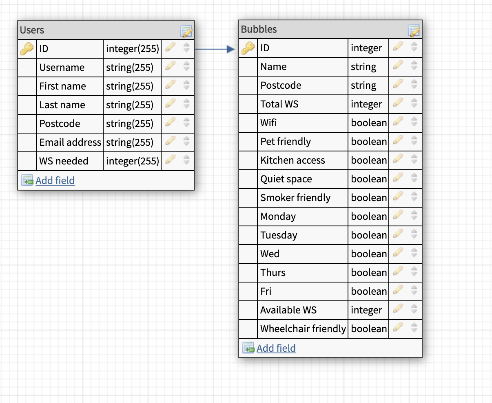

# workwithme

Modify database in database.js in model to put our own database table definitions

### 2. Create and Configure Database

#### 2.1
Create a MySQL database via the MySQL CLI; you can call it `workwithme`.
```
CREATE DATABASE workwithme;
```

#### 2.2
Create the table and add seed data via the shell.
```
mysql workwithme < usertables.sql
mysql workwithme < users.sql
```

#### 2.3
Create an `.env` file in the project directory that contains connect information for the DB.
(Your details may differ.)
```
DB_HOST=localhost
DB_USER=root
DB_PASS=root
DB_NAME=workwithme
```


